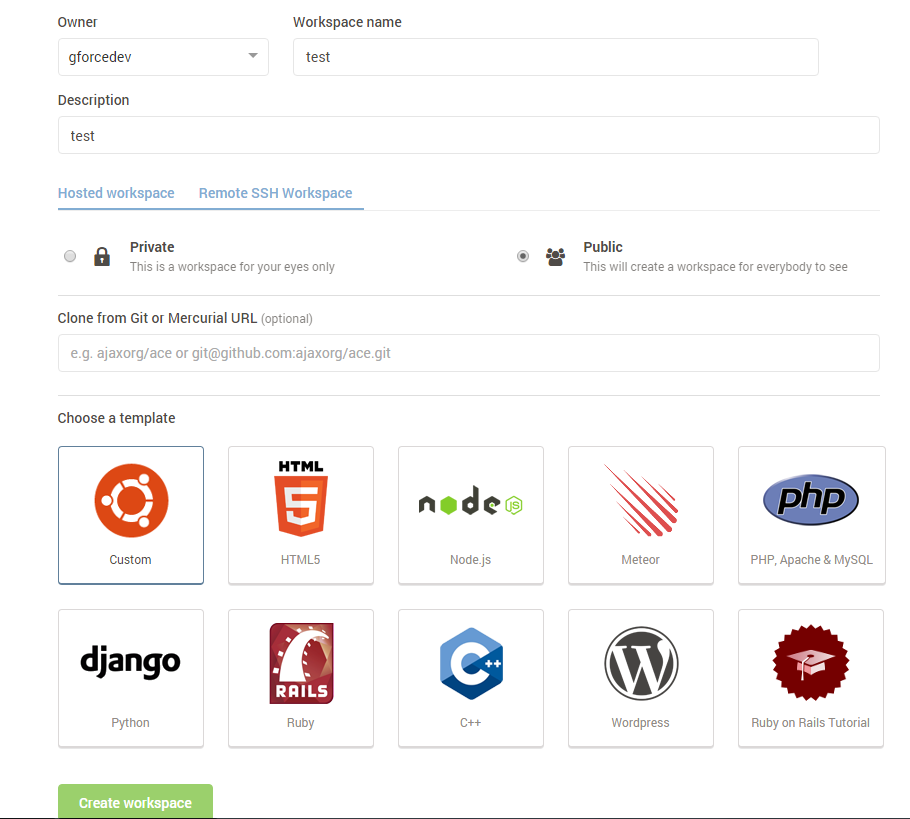

#3. Add a file

Now, we are able to create our basic html page. If you have already done the Web Development worksheet, then you could
download your work from that and then do file-upload local files to upload it. If not, then you can do file-new file and put in the following: 

```html
<!DOCTYPE html>
<html>
<head>
    <title>Test Page</title>
</head>
<body>
    <h1>Welcome to my page!</h1>
    <p>
        My page has some fake content. <br>
        Here is some more.
    </p>
</body>
</html>
```

If you wanted to change your content then you could. Maybe you could copy your svg emoji in as well.

When you are done, hit ctrl+S to save your file.

