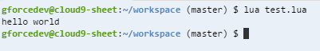

#7. Installing programs.

In the terminal, type `lua`. It should spit out "command not found".
Now do `sudo apt-get install lua5.2`. It will say lots and eventually let you type again. Lua has now been installed.
If you type `lua` again, it will bring you into a lua prompt. Press ctrl+C to exit.

---

Here is what happened: 

`sudo`: give you admin privelages for the fake computer.
`apt-get`: this is the package manager.
`install`: this is a package manager command for install new package.
`lua5.2`: the package to install

Now you can also write a lua script and run it using this command:

Now you can just write 'lua' and then the name of your file to run it.